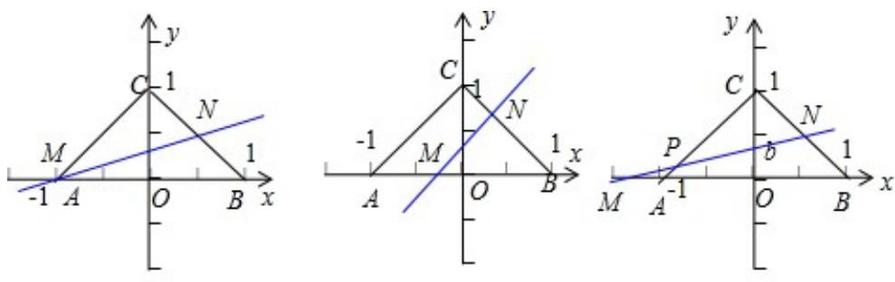

> [!faq]- 2013年全国统一高考数学试卷（理科）（新课标ⅱ）（含解析版）解析
>
> > [!success]- **【答案】** B
>
> > [!note]- **【分析】**
> > 解法一: 先求得直线 $y = ax + b (a > 0)$ 与 $x$ 轴的交点为 $M(-\frac{b}{a}, 0)$ ，由 $-\frac{b}{a} \leqslant 0$ 可得点 $M$ 在射线 $OA$ 上。求出直线和 $BC$ 的交点 $N$ 的坐标，①若点 $M$ 和点 $A$ 重合，求得 $b = \frac{1}{3}$ ；②若点 $M$ 在点 $O$ 和点 $A$ 之间，求得 $\frac{1}{3} < b < \frac{1}{2}$ ；③若点 $M$ 在点 $A$ 的左侧，求得 $\frac{1}{3} > b > 1 - \frac{\sqrt{2}}{2}$ 。再把以上得到的三个 $b$ 的范围取并集，可得结果。
>
> > [!note]- **【解析】**
> > 分析】解法一: 先求得直线 $y = ax + b (a > 0)$ 与 $x$ 轴的交点为 $M(-\frac{b}{a}, 0)$ ，由 $-\frac{b}{a} \leqslant 0$ 可得点 $M$ 在射线 $OA$ 上。求出直线和 $BC$ 的交点 $N$ 的坐标，①若点 $M$ 和点 $A$ 重合，求得 $b = \frac{1}{3}$ ；②若点 $M$ 在点 $O$ 和点 $A$ 之间，求得 $\frac{1}{3} < b < \frac{1}{2}$ ；③若点 $M$ 在点 $A$ 的左侧，求得 $\frac{1}{3} > b > 1 - \frac{\sqrt{2}}{2}$ 。再把以上得到的三个 $b$ 的范围取并集，可得结果。
> >
> > 解法二：考查临界位置时对应的 b 值，综合可得结论.
> >
> > 【
> > 解答】解：解法一：由题意可得，三角形ABC的面积为 $\frac{1}{2} \cdot AB \cdot OC = 1$
> >
> > 由于直线 $y=ax+b$ （a>0）与 x 轴的交点为 M（ $-\frac{b}{a}$ ，0），
> >
> > 由直线 $y=ax+b$ （a>0）将 $\triangle ABC$ 分割为面积相等的两部分，可得 b>0，
> >
> > 故 $-\frac{b}{a} \leqslant 0$ ，故点 $M$ 在射线 $OA$ 上.
> >
> > 设直线 $y = ax + b$ 和 BC 的交点为 N，则由 $\left\{ \begin{array}{l} y = ax + b \\ x + y = 1 \end{array} \right.$ 可得点 N 的坐标为 $\left( \frac{1 - b}{a + 1}, \frac{a + b}{a + 1} \right)$
> >
> > ① 若点 M 和点 A 重合，则点 N 为线段 BC 的中点，故 N（ $\frac{1}{2}$ ， $\frac{1}{2}$ ），
> >
> > 把 A、N 两点的坐标代入直线 y=ax+b，求得 $a=b=\frac{1}{3}$ .
> >
> > ② 若点 M 在点 O 和点 A 之间，此时 $b > \frac{1}{3}$ ，点 N 在点 B 和点 C 之间，
> >
> >   
> > ①  
> > ②  
> > ③
> >
> > 由题意可得三角形NMB的面积等于 $\frac{1}{2}$
> >
> > 即 $\frac{1}{2} \cdot \mathrm{MB} \cdot \mathrm{y}_{\mathbb{N}} = \frac{1}{2}$ ，即 $\frac{1}{2} \times (1 + \frac{\mathrm{b}}{\mathrm{a}}) \cdot \frac{\mathrm{a} + \mathrm{b}}{\mathrm{a} + 1} = \frac{1}{2}$ ，可得 $a = \frac{b^2}{1 - 2b} > 0$ ，求得 $b < \frac{1}{2}$ ，故有 $\frac{1}{3} < b < \frac{1}{2}$ .
> >
> > ③ 若点 M 在点 A 的左侧，则 $b < \frac{1}{3}$ ，由点 M 的横坐标 $-\frac{b}{a} < -1$ ，求得 b > a。
> > 设直线 $y = ax + b$ 和 AC 的交点为 P，则由 $\left\{\begin{aligned}y &= ax + b \\ y &= x + 1\end{aligned}\right.$ 求得点 P 的坐标为 $\left(\frac{1-b}{a-1}, \frac{a-b}{a-1}\right)$ ，
> > 此时，由题意可得，三角形 CPN 的面积等于 $\frac{1}{2}$ ，即 $\frac{1}{2} \cdot (1 - b) \cdot |x_{N} - x_{P}| = \frac{1}{2}$ ，
> > 即 $\frac{1}{2}(1 - b) \cdot |\frac{1 - b}{a+1} - \frac{1 - b}{a-1}| = \frac{1}{2}$ ，化简可得 $2(1 - b)^{2} = |a^{2} - 1|$ .
> >
> > 由于此时 $b > a > 0$ ， $0 < a < 1$ ， $\therefore 2(1 - b)^{2} = |a^{2} - 1| = 1 - a^{2}$
> >
> > 两边开方可得 $\sqrt{2} (1 - b) = \sqrt{1 - a^2} < 1, \therefore 1 - b < \frac{1}{\sqrt{2}}$ ，化简可得 $b > 1 - \frac{\sqrt{2}}{2}$ ，故有 $1 - \frac{\sqrt{2}}{2} < b < \frac{1}{3}$ .
> >
> > 再把以上得到的三个 b 的范围取并集，可得 b 的取值范围应是 $\left(1\frac{\sqrt{2}}{2}, \frac{1}{2}\right)$ ，故选：B.
> >
> > 解法二：当 a=0 时，直线 $y=ax+b$ （a>0）平行于 AB 边，
> >
> > 由题意根据三角形相似且面积比等于相似比的平方可得 $\left(\frac{1 - b}{1}\right)^2 = \frac{1}{2}, b = 1 - \frac{\sqrt{2}}{2}$
> >
> > 趋于最小。
> >
> > 由于 a>0，∴b>1- $\frac{\sqrt{2}}{2}$ .
> >
> > 当 a 逐渐变大时，b 也逐渐变大，
> >
> > 当 $b = \frac{1}{2}$ 时，直线经过点 $(0, \frac{1}{2})$ ，再根据直线平分 $\triangle ABC$ 的面积，故 $a$ 不存在，故 $b < \frac{1}{2}$ .
> >
> > 综上可得， $1 - \frac{\sqrt{2}}{2} < b < \frac{1}{2}$
> >
> > 故选：B.
> >
> > 【点评】本题主要考查确定直线的要素，点到直线的距离公式以及三角形的面积
> >
> > 公式的应用，还考察运算能力以及综合
> > 分析能力，分类讨论思想，属于难题.
> >
> > ## 二、填空题：本大题共4小题，每小题5分.
