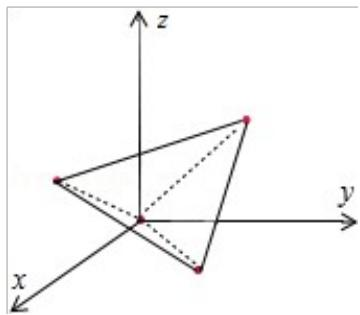

> [!faq]- 2013年全国统一高考数学试卷（理科）（新课标ⅱ）（含解析版）解析
>
> > [!success]- **【答案】** A
>
> > [!note]- **【分析】**
> > 由题意画出几何体的直观图, 然后判断以 zOx 平面为投影面, 则得到正视
>
> > [!note]- **【解析】**
> > 分析】由题意画出几何体的直观图, 然后判断以 zOx 平面为投影面, 则得到正视
> >
> > 图即可.
> >
> > 【
> > 解答】解：因为一个四面体的顶点在空间直角坐标系 O-xyz 中的坐标分别是
> >
> > $(1,0,1)$ , $(1,1,0)$ , $(0,1,1)$ , $(0,0,0)$ , 几何体的直观图如图, 是正方体的
> >
> > 顶点为顶点的一个正四面体，所以以 zOx 平面为投影面，则得到正视图为：
> >
> > 
> >
> > 故选：A.
> >
> > # 【点评】本题考查几何体的三视图的判断，根据题意画出几何体的直观图是解题
> >
> > 的关键，考查空间想象能力.
