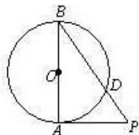

<!-- question-source:start -->
11.如图，AB为圆O的直径，PA为圆O的切线，PB与圆O相交于D，PA=3， $\frac{PD}{DB}=\frac{9}{16}$ ，则PD=-

，AB=\_\_\_\_.

<!-- question-source:end -->

![[高中/真题/按年份分类/2013/2013年北京高考理科数学试题及答案/填空题/题目/answers/Q00023187A1.md]]
