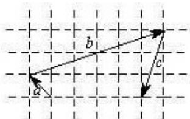

<!-- question-source:start -->
13. 向量 a, b, c 在正方形网格中的位置如图所示，若 $c = \lambda a + \mu b (\lambda, \mu \in \mathbb{R})$

，则 $\frac{\lambda}{\mu} =$

<!-- question-source:end -->

![[高中/真题/按年份分类/2013/2013年北京高考理科数学试题及答案/填空题/题目/answers/Q00023189A1.md]]
