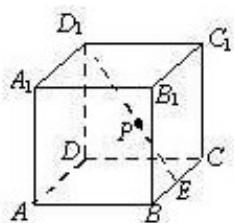

<!-- question-source:start -->
14.如图, 在棱长为 2 的正方体 $ABCD-A_{1}B_{1}C_{1}D_{1}$ 中, $E$ 为 $BC$ 的中点, 点 $P$ 在线段 $D_{1}E$ 上, 点 $P$ 到直线 $CC_{1}$ 的距离的最小值为 \_\_\_\_.

##
<!-- question-source:end -->

![[高中/真题/按年份分类/2013/2013年北京高考理科数学试题及答案/填空题/题目/answers/Q00029829A1.md]]
