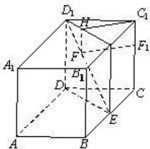

> [!faq]- 2013年北京高考理科数学试题及答案解析
>
> > [!success]- **【答案】** 详见解析
>
> > [!note]- **【分析】**
> > 本题未单列分析。
>
> > [!note]- **【解析】**
> > 过F做FH垂直上底面 $A_{1}B_{1}C_{1}D_{1}$
> >
> > 过E作直线 $EE_{1}$ 垂直底面 $A_{1}B_{1}C_{1}D_{1},E_{1}$ 在线段 $B_{1}C_{1}$ 上
> >
> > 
> >
> > F到线段 $CC_{1}$ 的距离= $HC_{1}$ .
> >
> > 当点F在线段 $BD_{1}$ 运动时，最小值为 $C_{1}$ 到线段 $EE_{1}$ 的高
> >
> > 所以最小值就是 $\Delta C_{1}D_{1}E_{1}$ 的高，为 $\frac{2\sqrt{5}}{5}$
> >
> > ##
