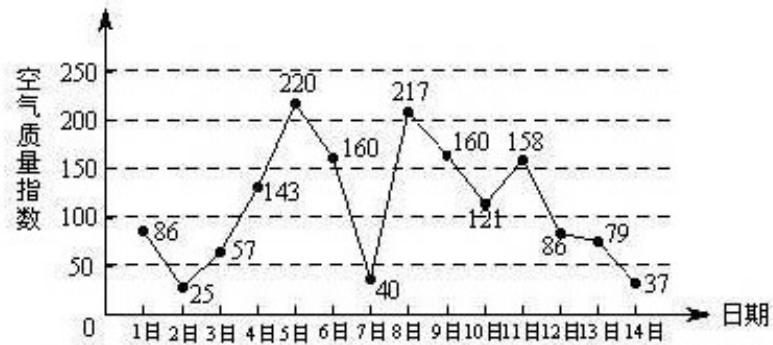

<!-- question-source:start -->
16.(本小题共13分)

下图是某市3月1日至14日的空气质量指数趋势图，空气质量指数小于100表示空气质量优良，空气质量指数大于200表示空气重度污染，某人随机选择3月1日至3月13日中的某一天到达该市，并停留2天

（Ⅰ）求此人到达当日空气重度污染的概率

（Ⅱ）设 X 是此人停留期间空气质量优良的天数，求 X 的分布列与数学期望。

（III）由图判断从哪天开始连续三天的空气质量指数方差最大？（结论不要求证明）
<!-- question-source:end -->

![[高中/真题/按年份分类/2013/2013年北京高考理科数学试题及答案/解答题/题目/answers/Q00023192A1.md]]
