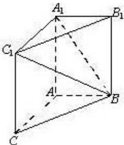

<!-- question-source:start -->
17. (本小题共 14 分)

如图，在三棱柱 $ABC-A_{1}B_{1}C_{1}$ 中， $AA_{1}C_{1}C$ 是边长为4的正方形.平面 $ABC\perp$ 平面 $AA_{1}C_{1}C$ ，AB=3，BC=5.

(Ⅰ) 求证: $AA_{1} \perp$ 平面 $ABC$ ;

（Ⅱ）求二面角 $A_{1}-BC_{1}-B_{1}$ 的余弦值；

（III）证明：在线段 $\mathrm{BC}_1$ 存在点D，使得 $AD\bot A_1B$ ，并求 $\frac{BD}{BC_1}$ 的值.

<!-- question-source:end -->

![[高中/真题/按年份分类/2013/2013年北京高考理科数学试题及答案/解答题/题目/answers/Q00023193A1.md]]
