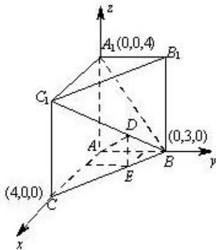

> [!faq]- 2013年北京高考理科数学试题及答案解析
>
> > [!success]- **【答案】** 详见解析
>
> > [!note]- **【分析】**
> > 本题未单列分析。
>
> > [!note]- **【解析】**
> > (1) $A_{1}ACC_{1}$ 是正方形 $\Rightarrow AA_{1} \perp AC$ 平面 $ABC \perp$ 平面 $A_{1}ACC_{1}\} \Rightarrow AA_{1} \perp$ 平面 $ABC$
> >
> > $AC = 4]$
> > (2) 由 $BC = 5\} \Rightarrow AC \perp AB$ $AB = 3]$
> > (2) 建立如图所示的空间直角坐标系 $A \rightarrow ACB$
> >
> > 
> >
> > $A_{1}(0,0,4), B(0,3,0)C_{1}(4,0,4), B_{1}(0,3,4)$
> >
> > $$
> > \overline {{{A _ {1} C _ {1}}}} = (4, 0, 0), \quad \overrightarrow {A _ {1} B} = (0, 3, - 4)
> > $$
> >
> > $$
> > B _ {1} C _ {1} ^ {\prime} = (4, - 3, 0), \quad B B _ {1} ^ {\prime} = (0, 0, 4)
> > $$
> >
> > 设平面 $A_{1}BC_{1}$ 的法向量为 $n_1(x_1,y_1,z_1)$ ，平面 $B_{1}BC_{1}$ 的法向量为 $n_2(x_2,y_2,z_2)$
> >
> > $$
> > \therefore \left\{ \begin{array}{l} A _ {1} C ^ {\prime} \cdot n _ {1} = 0 \\ A _ {1} B \cdot n _ {1} = 0 \end{array} \Rightarrow \left\{ \begin{array}{l} 4 x _ {1} = 0 \\ (3 y _ {1} - 4 z _ {1} = 0 \end{array} \right. \Rightarrow n _ {1} ^ {\prime} = (0, 4, 3) \right.
> > $$
> >
> > $$
> > \left\{ \begin{array}{l} B _ {1} C _ {1} ^ {\prime} \cdot n _ {1} ^ {\prime} = 0 \\ B B _ {1} ^ {\prime} \cdot n _ {2} ^ {\prime} = 0 \end{array} \Rightarrow \left\{ \begin{array}{l} 4 x _ {2} - 3 y _ {2} = 0 \\ 4 z _ {2} = 0 \end{array} \Rightarrow n _ {2} ^ {\prime} = (3, 4, 0) \right. \right.
> > $$
> >
> > $$
> > \cos \theta = \frac {n _ {1} \cdot n _ {2}}{| \overline {{n _ {1}}} | \cdot | \overline {{n _ {2}}} |} = \frac {1 6}{5 \times 5} = \frac {1 6}{2 5}
> > $$
> > (3) 设点 $D$ 的竖轴坐标为 $t (0 < t < 4)$ , 在平面 $BCC_{1}B_{1}$ 中作 $DE \perp BC + E$ , 根据比例关系可知
> >
> > $$
> > D \left(t, \frac {3}{4} (4 - t), t\right) (0 <   t <   4)
> > $$
> >
> > $$
> > \therefore A D = \left(t, \frac {3}{4} (4 - t), t\right)
> > $$
> >
> > $$
> > A \ddot {B} = (0, 3, - 4)
> > $$
> >
> > $$
> > \text {   又   } \because A D \perp A _ {1} B
> > $$
> >
> > $$
> > \therefore \frac {9}{4} (4 - t) - 4 t = 0
> > $$
> >
> > $$
> > \therefore t = \frac {3 6}{2 5}
> > $$
> >
> > $$
> > \therefore \frac {B D}{B C _ {1}} = \frac {D E}{C C _ {1}} = \frac {9}{2 5}
> > $$
