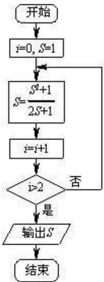

<!-- question-source:start -->
4.执行如图所示的程序框图，输出的 S 值为
A.1 B. $\frac{2}{3}$ C. $\frac{13}{21}$ D. $\frac{610}{987}$

<!-- question-source:end -->

![[高中/真题/按年份分类/2013/2013年北京高考理科数学试题及答案/选择题/题目/answers/Q00023180A1.md]]
