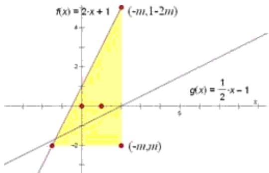

> [!faq]- 2013年北京高考理科数学试题及答案解析
>
> > [!success]- **【答案】** C
>
> > [!note]- **【分析】**
> > 本题未单列分析。
>
> > [!note]- **【解析】**
> > 答案：C
> >
> > 本题线性规划图示:
> >
> > 
> >
> > 要使可行域存在，必有 $m < -2m + 1$ ，要求可行域内包含直
> >
> > 线 $y = \frac{1}{2} x - 1$ 上的点，只要边界点 $(-m, 1 - 2m)$ 在直线 $y = \frac{1}{2} x - 1$ 上方，且 $(-m, m)$ 在直线 $y = \frac{1}{2} x - 1$ 下方，解不等式组 $\left\{ \begin{array}{l} m < 1 - 2m \\ 1 - 2m > -\frac{1}{2} m - 1 \text{得} m < -\frac{2}{3} \\ m < -\frac{1}{2} m - 1 \end{array} \right.$
> >
> > ##
> > 二、填空题
