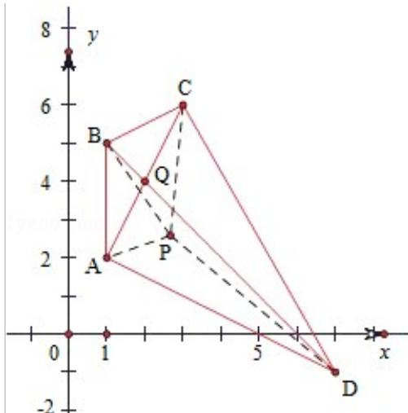

> [!faq]- 2013年四川高考文科数学试卷(word版)和答案解析
>
> > [!success]- **【答案】** （2，4）
>
> > [!note]- **【分析】**
> > 如图，设平面直角坐标系中任一点P，利用三角形中两边之和大于第三边得
>
> > [!note]- **【解析】**
> > 解：如图，设平面直角坐标系中任一点 P，
> >
> > P 到点 A（1，2），B（1，5），C（3，6），D（7，-1）的距离之和为：
> >
> > $\mathrm{PA + PB + PC + PD = PB + PD + PA + PC\geq BD + AC = QA + QB + QC + QD},$
> >
> > 故四边形 ABCD 对角线的交点 Q 即为所求距离之和最小的点.
> >
> > ∵A（1，2），B（1，5），C（3，6），D（7，-1），
> >
> > ∴AC，BD的方程分别为： $\frac{y-2}{6-2}=\frac{x-1}{3-1},\quad\frac{y-5}{-1-5}=\frac{x-1}{7-1},$
> >
> > 即 2x - y = 0, x + y - 6 = 0.
> >
> > 解方程组 $\left\{\begin{aligned}&2x-y=0\\&x+y-6=0\end{aligned}\right.$ 得Q(2,4).
> >
> > 故答案为：（2，4）.
> >
> > 
> >
> > 点评：本小题主要考查直线方程的应用、三角形的性质等基础知识，考查运算求解能力，考查数形结合思想、化归与转化思想。属于基础题。
> >
> > ##
> > 三、解答题：本大题共6小题，共75分．解答应写出文字说明，证明过程或演算步骤.
