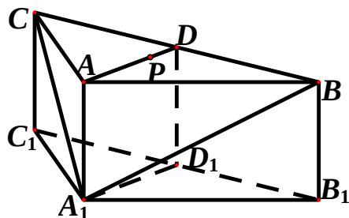

<!-- question-source:start -->
16、(本小题满分 12 分)

在等比数列 $\{a_{n}\}$ 中， $a_2 - a_1 = 2$ ，且 $2a_{2}$ 为 $3a_{1}$ 和 $a_3$ 的等差中项，求数列 $\{a_{n}\}$ 的首项、公比及前 $n$ 项和。

## 17、(本小题满分 12 分)

在 $\Delta ABC$ 中，角 A, B, C 的对边分别为 a, b, c，且 $\cos(A - B)\cos B - \sin(A - B)\sin(A + c) = -\frac{3}{5}$ 。

(Ⅰ) 求 $\sin A$ 的值;

（Ⅱ）若 $a=4\sqrt{2}$ ，b=5，求向量 BA 在 BC 方向上的投影。

## 18、(本小题满分 12 分)

某算法的程序框图如图所示，其中输入的变量 x 在 $1,2,3,\cdots;24$ 这 24 个整数中等可能随机产生。

（Ⅰ）分别求出按程序框图正确编程运行时输出 y 的值为 i 的概率 $P_{i}(i=1,2,3)$ ;

（II）甲、乙两同学依据自己对程序框图的理解，各自编写程序重复运行 $n$ 次后，统计记录了输出 $y$ 的值为 $i(i = 1,2,3)$ 的频数。以下是甲、乙所作频数统计表的部分数据。

甲的频数统计表（部分）

<table><tr><td>运行次数n</td><td>输出y的值为1的频数</td><td>输出y的值为2的频数</td><td>输出y的值为3的频数</td></tr><tr><td>30</td><td>14</td><td>6</td><td>10</td></tr><tr><td>...</td><td>...</td><td>...</td><td>...</td></tr><tr><td>2100</td><td>1027</td><td>376</td><td>697</td></tr></table>

乙的频数统计表（部分）  
当 $n = 2100$ 时，根据表中的数据，分别写出甲、

<table><tr><td>运行次数n</td><td>输出y的值为1的频数</td><td>输出y的值为2的频数</td><td>输出y的值为3的频数</td></tr><tr><td>30</td><td>12</td><td>11</td><td>7</td></tr><tr><td>...</td><td>...</td><td>...</td><td>...</td></tr><tr><td>2100</td><td>1051</td><td>696</td><td>353</td></tr></table>

乙所编程序各自输出 y 的值为 $i(i=1,2,3)$ 的频率（用分数表示），并判断两位同学中哪一位所编写程序符合算法要求的可能性较大。

## 19、(本小题满分 12 分)

如图，在三棱柱 $ABC - A_{1}B_{1}C$ 中，侧棱 $AA_{1}\perp$ 底面 $ABC$ ， $AB = AC = 2AA_{1} = 2$ ， $\angle BAC = 120^{\circ}$ $D,D_{1}$ 分别是线段 $BC,B_{1}C_{1}$ 的中点， $P$ 是线段 $AD$ 上异于端点的点。

（1）在平面 ABC 内，试作出过点 P 与平面 $A_{1}BC$ 平行的直线 l，说明理由，并证明直线 $l \perp$ 平面 $ADD_{1}A_{1}$ ;

（Ⅱ）设（Ⅰ）中的直线 l 交 AC 于点 Q，求三棱锥 $A_{1}-QC_{1}D$ 的体积。
(锥体体积公式： $V=\frac{1}{3}Sh$ ，其中S为底面面积，h为高)

## 20、(本小题满分 13 分)

已知圆 $C$ 的方程为 $x^{2} + (y - 4)^{2} = 4$ ，点 $O$ 是坐标原点。直线 $l:y = kx$ 与圆 $C$ 交于 $M,N$ 两点。

（Ⅰ）求 $k$ 的取值范围；

（Ⅱ）设 $Q(m,n)$ 是线段 $MN$ 上的点，且 $\frac{2}{|OQ|^2} = \frac{1}{|OM|^2} +\frac{1}{|ON|^2}$ 。请将 $n$ 表示为 $m$ 的函数。

## 21、(本小题满分 14 分)

已知函数 $f(x) = \begin{cases} x^2 + 2x + a, & x < 0 \\ \ln x, & x > 0 \end{cases}$ ，其中 $a$ 是实数。设 $A(x_1, f(x_1))$ ， $B(x_2, f(x_2))$ 为该函数图象上的两点，且 $x_1 < x_2$ 。

（Ⅰ）指出函数 $f(x)$ 的单调区间；

（Ⅱ）若函数 $f(x)$ 的图象在点 A, B 处的切线互相垂直，且 $x_{2} < 0$ ，证明： $x_{2} - x_{1} \geq 1$ ;

（III）若函数 $f(x)$ 的图象在点 A, B 处的切线重合，求 a 的取值范围。

#
#
<!-- question-source:end -->

![[高中/真题/按年份分类/2013/2013年四川高考文科数学试卷_word版_和答案/解答题/题目/answers/Q00026602A1.md]]
