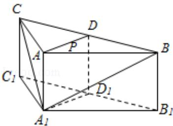

<!-- question-source:start -->
19. （12分）（2013·四川）如图，在三棱柱 $\mathrm{ABC - A_1B_1C}$ 中，侧棱 $\mathrm{AA}_1\bot$ 底面

ABC, AB=AC=2AA $_{1}$ =2, ∠BAC=120°, D, D $_{1}$ 分别是线段BC, B $_{1}$ C $_{1}$ 的中点, P是线段AD上异于端点的点. (Ⅰ) 在平面ABC内, 试作出过点P与平面A $_{1}$ BC平行的直线l, 说明理由, 并证明直线l⊥平面ADD $_{1}$ A $_{1}$ ; (Ⅱ) 设(Ⅰ)中的直线l交AC于点Q, 求三棱锥A $_{1}$ -QC $_{1}$ D的体积. (锥体体积公式: V= $\frac{1}{3}$ Sh, 其中S为底面面积, h为高)

考点：直线与平面垂直的判定；棱柱、棱锥、棱台的体积.

专题：空间位置关系与距离.
<!-- question-source:end -->

![[高中/真题/按年份分类/2013/2013年四川高考文科数学试卷_word版_和答案/解答题/题目/answers/Q00026606A1.md]]
