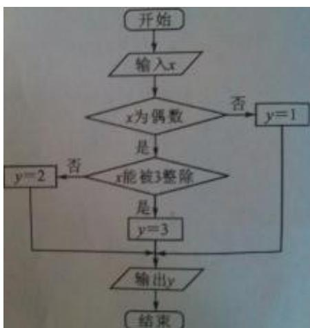

<!-- question-source:start -->
## 18、(本小题满分 12 分)

某算法的程序框图如图所示，其中输入的变量 x 在 $1,2,3,\cdots;24$ 这 24 个整数中等可能随机产生。

（Ⅰ）分别求出按程序框图正确编程运行时输出 y 的值为 i 的概率 $P_{i}(i=1,2,3)$ ;

（II）甲、乙两同学依据自己对程序框图的理解，各自编写程序重复运行 $n$ 次后，统计记录了输出 $y$ 的值为 $i(i = 1,2,3)$ 的频数。以下是甲、乙所作频数统计表的部分数据。

甲的频数统计表（部分）

<table><tr><td>运行次数n</td><td>输出y的值为1的频数</td><td>输出y的值为2的频数</td><td>输出y的值为3的频数</td></tr><tr><td>30</td><td>14</td><td>6</td><td>10</td></tr><tr><td>...</td><td>...</td><td>...</td><td>...</td></tr><tr><td>2100</td><td>1027</td><td>376</td><td>697</td></tr></table>

乙的频数统计表（部分）  
当 $n = 2100$ 时，根据表中的数据，分别写出甲、

<table><tr><td>运行次数n</td><td>输出y的值为1的频数</td><td>输出y的值为2的频数</td><td>输出y的值为3的频数</td></tr><tr><td>30</td><td>12</td><td>11</td><td>7</td></tr><tr><td>...</td><td>...</td><td>...</td><td>...</td></tr><tr><td>2100</td><td>1051</td><td>696</td><td>353</td></tr></table>

乙所编程序各自输出 y 的值为 $i(i=1,2,3)$ 的频率（用分数表示），并判断两位同学中哪一位所编写程序符合算法要求的可能性较大。
<!-- question-source:end -->

![[高中/真题/按年份分类/2013/2013年四川高考文科数学试卷_word版_和答案/解答题/题目/answers/Q00028212A1.md]]
