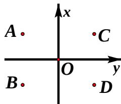

<!-- question-source:start -->
3、如图, 在复平面内, 点 $A$ 表示复数 $z$ , 则图中表示 $z$ 的共轭复数的点是 ( )

(A) A

(B) B

(C) C

(D) D

<!-- question-source:end -->

![[高中/真题/按年份分类/2013/2013年四川高考文科数学试卷_word版_和答案/选择题/题目/answers/Q00026590A1.md]]
