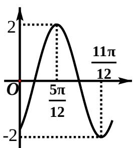

<!-- question-source:start -->
6、函数 $f(x) = 2\sin (\omega x + \varphi)(\omega > 0, -\frac{\pi}{2} < \varphi < \frac{\pi}{2})$ 的部分图象如图所示，则$\omega, \varphi$ 的值分别是（）
(A) $2, -\frac{\pi}{3}$ (B) $2, -\frac{\pi}{6}$ (C) $4, -\frac{\pi}{6}$ (D) $4, \frac{\pi}{3}$

<!-- question-source:end -->

![[高中/真题/按年份分类/2013/2013年四川高考文科数学试卷_word版_和答案/选择题/题目/answers/Q00026593A1.md]]
