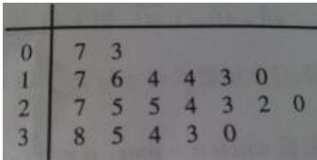
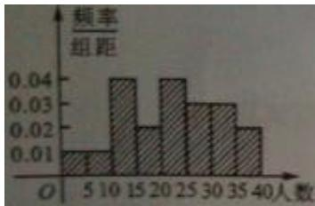
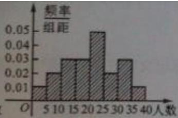
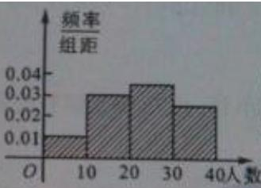
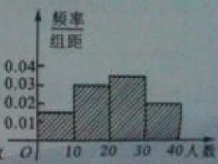

<!-- question-source:start -->
7、某学校随机抽取20个班，调查各班中有网上购物经历的人数，所得数据的茎叶图如图所示。以组距为5将数据分组成[0,5)，[5,10)，…，[30,35)，[35,40]时，所作的频率分布直方图是（）

  
(A)

  
(B)

  
(C)

  
(D)
<!-- question-source:end -->

![[高中/真题/按年份分类/2013/2013年四川高考文科数学试卷_word版_和答案/选择题/题目/answers/Q00026594A1.md]]
