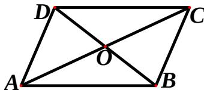

<!-- question-source:start -->
11. (A) [1,e]    (B) [1,1+e]    (C) [e,1+e]    (D) [0,1]

## 第二部分 （非选择题 共 100 分）

注意事项：

必须使用 0.5 毫米黑色签字笔在答题卡上题目所指示的答题区域内作答。作图题可先用铅笔绘出，确认后再用 0.5 毫米黑色墨迹签字笔描清楚。答在试题卷上无效。

##
二、填空题：本大题共5小题，每小题5分，共25分。

11、 $\lg \sqrt{5} + \lg \sqrt{20}$ 的值是\_\_\_\_。

<!-- question-source:end -->

![[高中/真题/按年份分类/2013/2013年四川高考文科数学试卷_word版_和答案/选择题/题目/answers/Q00028208A1.md]]
