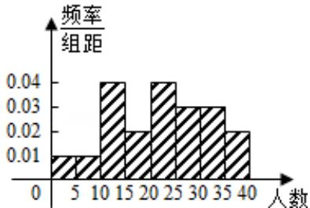

> [!faq]- 2013年四川高考文科数学试卷(word版)和答案解析
>
> > [!success]- **【答案】** 详见解析
>
> > [!note]- **【分析】**
> > 根据题意，由频率与频数的关系，计算可得各组的频率，进而可以做出频率分布表，结合分布表，进而可以做出频率分布直方图.
>
> > [!note]- **【解析】**
> > 解：根据题意，频率分布表可得：
> >
> > <table><tr><td>分组</td><td>频数</td><td>频率</td></tr><tr><td>[0, 5)</td><td>1</td><td>0.05</td></tr><tr><td>[5, 10)</td><td>1</td><td>0.05</td></tr><tr><td>[10, 15)</td><td>4</td><td>0.20</td></tr><tr><td>...[30, 35)</td><td>...3</td><td>...0.15</td></tr><tr><td>[35, 40)</td><td>2</td><td>0.10</td></tr><tr><td>合计</td><td>100</td><td>1.00</td></tr></table>
> >
> > 进而可以作频率直方图可得：
> >
> >   
> > 故选：A.
> >
> > 点评：本题考查频率分布直方图的作法与运用，关键是正确理解频率分布表、频率分步直方图的意义并运用.
