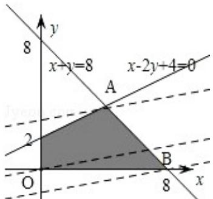

> [!faq]- 2013年四川高考文科数学试卷(word版)和答案解析
>
> > [!success]- **【答案】** 详见解析
>
> > [!note]- **【分析】**
> > 先根据条件画出可行域，设 $z = 5y - x$ ，再利用几何意义求最值，将最小值转化为 $y$ 轴上的截距最大，只需求出直线，过可行域内的点 B（8，0）时的最小值，过点 A（4，4）时， $5y - x$ 最大，从而得到 a - b 的值.
>
> > [!note]- **【解析】**
> > 解：满足约束条件 $\left\{\begin{aligned}x+y&\leqslant8\\ 2y-x&\leqslant4\\ x&\geqslant0\\ y&\geqslant0\end{aligned}\right.$ 的可行域如图所示
> >
> > 在坐标系中画出可行域，
> >
> > 平移直线 $5y - x = 0$ ，经过点 B（8，0）时，5y - x 最小，最小值为：-8，
> >
> > 则目标函数 $z = 5y - x$ 的最小值为-8.
> >
> > 经过点 A（4，4）时，5y - x 最大，最大值为：16，
> >
> > 则目标函数 $z = 5y - x$ 的最大值为16.
> >
> > $z=5y-x$ 的最大值为 a，最小值为 b，则 a-b 的值是：24.
> >
> > 故选C.
> >
> > 
> >
> > 点评：借助于平面区域特性，用几何方法处理代数问题，体现了数形结合思想、化归思想。线性规划中的最优解，通常是利用平移直线法确定。
