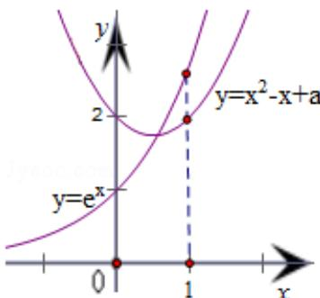

> [!faq]- 2013年四川高考文科数学试卷(word版)和答案解析
>
> > [!success]- **【答案】** 详见解析
>
> > [!note]- **【分析】**
> > 根据题意，问题转化为“存在 $b \in [0,1]$ ，使 $f(b) = f^{-1}(b)$ ”，即 $y = f(x)$ 的图象与函数 $y = f^{-1}(x)$ 的图象有交点，且交点的横坐标 $b \in [0,1]$ . 由 $y = f(x)$ 的图象与 $y = f^{-1}(x)$ 的图象关于直线 $y = x$ 对称，得到函数 $y = f(x)$ 的图象与 $y = x$ 有交点，且交点横坐标 $b \in [0,1]$ . 因此，将方程 $\sqrt{e^x + x - a} = x$ 化简整理得 $e^x = x^2 - x + a$ ，记 $F(x) = e^x$ , $G(x) = x^2 - x + a$ ，由零点存在性定理建立关于 $a$ 的不等式组，解之即可得到实数 $a$ 的取值范围.
>
> > [!note]- **【解析】**
> > 分析：根据题意，问题转化为“存在 $b \in [0,1]$ ，使 $f(b) = f^{-1}(b)$ ”，即 $y = f(x)$ 的图象与函数 $y = f^{-1}(x)$ 的图象有交点，且交点的横坐标 $b \in [0,1]$ . 由 $y = f(x)$ 的图象与 $y = f^{-1}(x)$ 的图象关于直线 $y = x$ 对称，得到函数 $y = f(x)$ 的图象与 $y = x$ 有交点，且交点横坐标 $b \in [0,1]$ . 因此，将方程 $\sqrt{e^x + x - a} = x$ 化简整理得 $e^x = x^2 - x + a$ ，记 $F(x) = e^x$ , $G(x) = x^2 - x + a$ ，由零点存在性定理建立关于 $a$ 的不等式组，解之即可得到实数 $a$ 的取值范围.
> >
> > 解答：解：由 $f(f(b)) = b$ ，可得 $f(b) = f^{-1}(b)$ 其中 $f^{-1}(x)$ 是函数 $f(x)$ 的反函数因此命题“存在 $b \in [0, 1]$ 使 $f(f(b)) = b$ 成立”，转化为“存在 $b \in [0, 1]$ ，使 $f(b) = f^{-1}(b)$ ”，即 $y = f(x)$ 的图象与函数 $y = f^{-1}(x)$ 的图象有交点，且交点的横坐标 $b \in [0, 1]$ ， $\because y = f(x)$ 的图象与 $y = f^{-1}(x)$ 的图象关于直线 $y = x$ 对称， $\therefore y = f(x)$ 的图象与函数 $y = f^{-1}(x)$ 的图象的交点必定在直线 $y = x$ 上，由此可得， $y = f(x)$ 的图象与直线 $y = x$ 有交点，且交点横坐标 $b \in [0, 1]$ ，根据 $\sqrt{e^x + x - a} = x$ ，化简整理得 $e^x = x^2 - x + a$ 记 $F(x) = e^x$ ， $G(x) = x^2 - x + a$ ，在同一坐标系内作出它们的图象，可得 $\begin{cases} F(0) \leqslant G(0) \\ F(1) \geqslant G(1) \end{cases}$ ，即 $\begin{cases} e^0 \leqslant 0^2 - 0 + a \\ e^1 \geqslant 1^2 - 1 + a \end{cases}$ ，解之得 $1 \leqslant a \leqslant e$ 即实数 $a$ 的取值范围为[1, e]
> >
> > 故选：A
> >
> > 
> >
> > 点评：本题给出含有根号与指数式的基本初等函数，在存在 $b \in [0,1]$ 使 $f(f(b)) = b$ 成立的情况下，求参数 $a$ 的取值范围。着重考查了基本初等函数的图象与性质、函数的零点存在性定理和互为反函数的两个函数的图象特征等知识，属于中档题。
> >
> > ##
