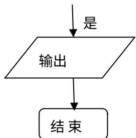

<!-- question-source:start -->
16、定义“正对数”： $\ln^{+}x = \begin{cases} 0, & 0 < x < 1, \\ \ln x, & x \geq 1. \end{cases}$ 现有四个命题：
① 若 $a > 0, b > 0$ ，则 $\ln^{+}(a^{b}) = b \ln^{+} a$ ；
② 若 $a > 0, b > 0$ ，则 $\ln^{+}(ab) = \ln^{+} a + \ln^{+} b$ ；

$$
\frac {1}{F _ {1}} \leq \varepsilon \text {否}
$$

③ 若 $a > 0, b > 0$ ，则 $\ln^{+}\left(\frac{a}{b}\right) \geq \ln^{+}a - \ln^{+}b$ ;

④ 若 $a > 0, b > 0$ ，则 $\ln^{+}(a + b) \leq \ln^{+}a + \ln^{+}b + \ln 2$ .

其中的真命题有\_\_\_\_。（写出所有真命题的编号）

##
三、解答题：本大题共6小题，共74分.
<!-- question-source:end -->

![[高中/真题/按年份分类/2013/2013年山东省高考数学试卷_理科_word版试卷及解析/填空题/题目/answers/Q00028217A1.md]]
