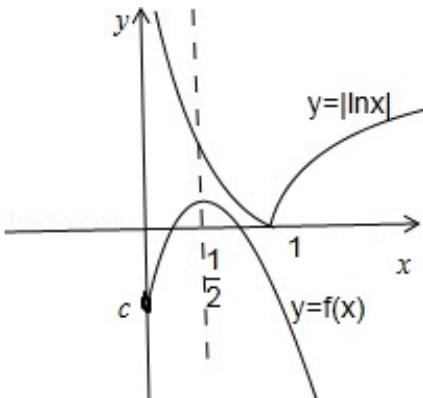

> [!faq]- 2013年山东省高考数学试卷(理科)word版试卷及解析解析
>
> > [!success]- **【答案】** 详见解析
>
> > [!note]- **【分析】**
> > 本题未单列分析。
>
> > [!note]- **【解析】**
> > 分析：
> >
> > 分析: (1) 利用导数的运算法则求出 $f'(x)$ ，分别解出 $f'(x) > 0$ 与 $f'(x) < 0$ 即可得出单调区间及极值与最值;
> >
> > (2) 分类讨论: ① 当 $0 < x \leq 1$ 时, 令 $u(x) = -\ln x - \frac{x}{e^{2x}} - c$ , ② 当 $x \geq 1$ 时, 令 $v(x) = \ln x - \frac{x}{e^{2x}} - c$ . 利用导数分别求出 $c$ 的取值范围, 即可得出结论.
> >
> > 解答：
> >
> > 解：（1）∵ $f'(x) = \frac{e^{2x} - x*2e^{2x}}{(e^{2x})^2} = \frac{1 - 2x}{e^{2x}}$ ，解 $f'(x) > 0$ ，得 $x < \frac{1}{2}$ ；解 $f'(x) < 0$ ，得 $x > \frac{1}{2}$ .
> >
> > ∴函数 $f(x)$ 的单调递增区间为 $(-∞, \frac{1}{2})$ ；单调递减区间为 $(\frac{1}{2}, +∞)$
> >
> > 故 $f(x)$ 在 $x=\frac{1}{2}$ 取得最大值，且 $f(x)_{\max}=\frac{1}{2e}+c$ .
> >
> > (2) 函数 $y = |\ln x|$ ，当 $x > 0$ 时的值域为 $[0, +\infty)$ 。如图所示：
> >
> > ① 当 $0 < x \leq 1$ 时，令 $u(x) = -\ln x - \frac{x}{e^{2x}} - c,$
> >
> > $c = -\ln x - \frac{x}{e^{2x}} = g(x)$ ,
> >
> > $$
> > g ^ {\prime} (x) = - \frac {1}{x} - \frac {1 - 2 x}{e ^ {2 x}} = - \frac {e ^ {2 x} + x - 2 x ^ {2}}{x e ^ {2 x}}.
> > $$
> >
> > 令 $h(x) = e^{2x} + x - 2x^2$ ，则 $h'(x) = 2e^{2x} + 1 - 4x > 0$ ， $\therefore h(x)$ 在 $x \in (0, 1]$ 单调递增，
> >
> > $$
> > \therefore 1 = h (0) <   h (x) \leqslant h (1) = e ^ {2} - 1.
> > $$
> >
> > $\therefore g'(x) < 0, \therefore g(x) \text{ 在 } x \in (0, 1] \text{ 单调递减.}$
> >
> > $$
> > \therefore c \geqslant g (1) = - \frac {1}{e ^ {2}}.
> > $$
> >
> > ② 当 $x \geq 1$ 时，令 $v(x) = \ln x - \frac{x}{e^{2x}} - c$ ，得到 $c = \ln x - \frac{x}{e^{2x}} = m(x)$ ，
> >
> > $$
> > m ^ {\prime} (x) = \frac {1}{x} - \frac {1 - 2 x}{e ^ {2 x}} = \frac {e ^ {2 x} + x (2 x - 1)}{x e ^ {2 x}} > 0.
> > $$
> >
> > 故 $m(x)$ 在 $[1, +\infty)$ 上单调递增， $\therefore c \geq m(1) = -\frac{1}{e^2}$ .
> >
> > 综上①②可知：当 $c < -\frac{1}{e^2}$ 时，方程 $|\ln x| = f(x)$ 无实数根；
> >
> > 当 $c = -\frac{1}{e^2}$ 时，方程 $|\ln x| = f(x)$ 有一个实数根；
> >
> > 当 $c > -\frac{1}{e^2}$ 时，方程 $|\ln x| = f(x)$ 有两个实数根.
> >
> > 
> >
> > 点评：本题综合考查了利用导数研究函数的单调性、极值最值、数形结合的思想方法、分类讨论的思想方法等基础知识与基本技能，考查了推理能力和计算能力及其化归思想方法.
