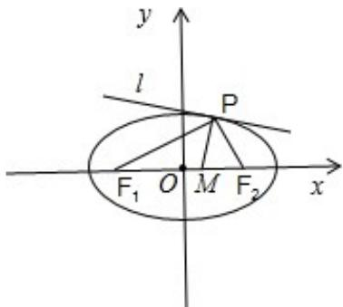

> [!faq]- 2013年山东省高考数学试卷(理科)word版试卷及解析解析
>
> > [!success]- **【答案】** 详见解析
>
> > [!note]- **【分析】**
> > (1) 把 -c 代入椭圆方程得 $\frac{c^2}{a^2} + \frac{y^2}{b^2} = 1$ ，解得 $y = \pm \frac{b^2}{a}$ ，由已知过 $F_1$ 且垂直于 $x$ 轴的直线被椭圆 $C$ 截得的线段长为 1，可得 $\frac{2b^2}{a} = 1$ 。再利用 $e = \frac{c}{a} = \frac{\sqrt{3}}{2}$ ，及 $a^2 = b^2 + c^2$ 即可得出；
> > (2) 设 $|\mathrm{PF}_1| = t, |\mathrm{PF}_2| = n$ ，由角平分线的性质可得 $\frac{t}{n} = \frac{|\mathbb{M}\mathrm{F}_1|}{|\mathrm{F}_2\mathbb{M}|} = \frac{\pi + \sqrt{3}}{\sqrt{3} - m}$ ，利用椭圆的定义可得 $t + n = 2a = 4$ ，消去 $t$ 得到 $\frac{4 - n}{n} = \frac{\sqrt{3} + m}{\sqrt{3} - \pi}$ ，化为 $n = \frac{2(\sqrt{3} - m)}{\sqrt{3}}$ ，再根据 $a - c < n < a + c$ ，即可得到 $m$ 的取值范围；
> > (3) 设 $P(x_0, y_0)$ ，不妨设 $y_0 > 0$ ，由椭圆方程 $\frac{x^2}{4} + y^2 = 1$ ，取 $y = \sqrt{1 - \frac{x^2}{4}}$ ，利用导数即可得到切线的斜率，再
>
> > [!note]- **【解析】**
> > 解：
> > （1）把-c代入椭圆方程得 $\frac{c^{2}}{a^{2}}+\frac{y^{2}}{b^{2}}=1$ ，解得 $y=\pm\frac{b^{2}}{a}$
> >
> > ∵过 $F_{1}$ 且垂直于 x 轴的直线被椭圆 C 截得的线段长为 1，∴ $\frac{2b^{2}}{a}=1$ .
> >
> > 又 $e=\frac{c}{a}=\frac{\sqrt{3}}{2}$ ，联立得 $\left\{\begin{aligned}\frac{2b^{2}}{a}&=1\\ a^{2}&=b^{2}+c^{2}\\ \frac{c}{a}&=\frac{\sqrt{3}}{2}\end{aligned}\right.$ 解得 $\left\{\begin{aligned}a&=2,b=1\\ c&=\sqrt{3}\end{aligned}\right.$ ∴椭圆 C 的方程为 $\frac{x^{2}}{4} + y^{2} = 1$ .
> > (2) 如图所示, 设 $|\mathrm{PF}_1| = t$ , $|\mathrm{PF}_2| = n$ ,
> >
> > 由角平分线的性质可得 $\frac{\mathrm{t}}{\mathrm{n}} = \frac{|\mathbb{M}\mathrm{F}_1|}{|\mathrm{F}_2\mathbb{M}|} = \frac{\pi + \sqrt{3}}{\sqrt{3} - \mathrm{m}}$
> >
> > 又 $t + n = 2a = 4$ ，消去 $t$ 得到 $\frac{4 - n}{n} = \frac{\sqrt{3} + m}{\sqrt{3} - \pi}$ ，化为 $n = \frac{2(\sqrt{3} - m)}{\sqrt{3}}$ ∴ $a - c <   n <   a + c$ ，即 $2 - \sqrt{3} <  n <   2 + \sqrt{3}$ ，也即 $2 - \sqrt{3} <  \frac{2(\sqrt{3} - m)}{\sqrt{3}} <  2 + \sqrt{3}$ ，解得 $-\frac{3}{2} <  m <   \frac{3}{2}.$ ∴m的取值范围；（ $-\frac{3}{2},\frac{3}{2}$ ）.
> > (3) 证明：设 $P(x_0, y_0)$ ，不妨设 $y_0 > 0$ ，由椭圆方程 $\frac{x^2}{4} + y^2 = 1$ ，取 $y = \sqrt{1 - \frac{x^2}{4}}$ ，则 $y' = \frac{-\frac{2x}{4}}{2\sqrt{1 - \frac{x^2}{4}}} = -\frac{x}{4\sqrt{1 - \frac{x^2}{4}}}$ ， $\therefore k = k_1 = -\frac{x_0}{4\sqrt{1 - \frac{x_0^2}{4}}} = -\frac{x_0}{4y_0}$ . $\because k_1 = \frac{y_0}{x_0 + \sqrt{3}}, k_2 = \frac{y_0}{x_0 - \sqrt{3}}$ $\therefore \frac{1}{k_1} + \frac{1}{k_2} = \frac{2x_0}{y_0}$ ， $\therefore \frac{1}{kk_1} + \frac{1}{kk_2} = -\frac{4y_0}{x_0} \times \frac{2x_0}{y_0} = -8$ 为定值.
> >
> > 
> >
> > 点评：本题综合考查了椭圆的定义、标准方程及其性质、角平分线的性质、利用导数的几何意义研究切线、斜率计算公式等基础知识，考查了推理能力、分类讨论的思想方法、计算能力、
