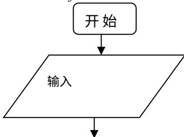

<!-- question-source:start -->
12、设正实数 $x, y, z$ 满足 $x^2 - 3xy + 4y^2 - z = 0$ . 则当 $\frac{xy}{z}$ 取得最大值时， $\frac{2}{x} + \frac{1}{y} - \frac{2}{z}$ 的最大值为

$$
\frac {9}{4}
$$

## 第Ⅱ卷（共90分）

<!-- question-source:end -->

![[高中/真题/按年份分类/2013/2013年山东省高考数学试卷_理科_word版试卷及解析/选择题/题目/answers/Q00023043A1.md]]
