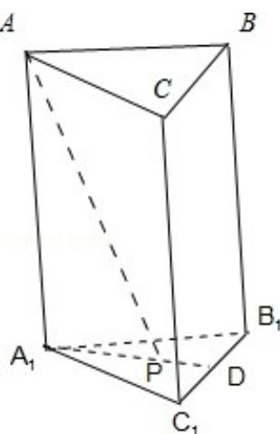

> [!faq]- 2013年山东省高考数学试卷(理科)word版试卷及解析解析
>
> > [!success]- **【答案】** 详见解析
>
> > [!note]- **【分析】**
> > 利用三棱柱 $ABC - A_{1}B_{1}C_{1}$ 的侧棱与底面垂直和线面角的定义可知, $\angle APA_{1}$ 为 PA 与平面 $A_{1}B_{1}C_{1}$ 所成角, 即为 $\angle APA_{1}$ 为 PA 与平面 ABC 所成角. 利用三棱锥的体积计算公式可得 $AA_{1}$ , 再利用正三角形的性质可得 $A_{1}P$ , 在 Rt $\triangle AA_{1}P$ 中, 利用 $\tan \angle APA_{1} = \frac{AA_{1}}{A_{1}P}$ 即可得出.
>
> > [!note]- **【解析】**
> > 分析: 利用三棱柱 $ABC - A_{1}B_{1}C_{1}$ 的侧棱与底面垂直和线面角的定义可知, $\angle APA_{1}$ 为 PA 与平面 $A_{1}B_{1}C_{1}$ 所成角, 即为 $\angle APA_{1}$ 为 PA 与平面 ABC 所成角. 利用三棱锥的体积计算公式可得 $AA_{1}$ , 再利用正三角形的性质可得 $A_{1}P$ , 在 Rt $\triangle AA_{1}P$ 中, 利用 $\tan \angle APA_{1} = \frac{AA_{1}}{A_{1}P}$ 即可得出.
> >
> > 解答：解：如图所示，
> >
> > ∵AA $_{1}$ ⊥底面A $_{1}$ B $_{1}$ C $_{1}$ ，∴∠APA $_{1}$ 为PA与平面A $_{1}$ B $_{1}$ C $_{1}$ 所成角，
> >
> > ∵平面ABC∥平面A $_{1}$ B $_{1}$ C $_{1}$ ，∴∠APA $_{1}$ 为PA与平面ABC所成角.
> >
> > ∵S $_{\triangle A_{1}B_{1}C_{1}}$ = $\frac{\sqrt{3}}{4}$ ×(√3) $^{2}$ = $\frac{3\sqrt{3}}{4}$ .
> >
> > ∴V $_{三棱柱ABC-A1B1C1}$ =AA $_{1}$ ×S $_{\triangle A_{1}B_{1}C_{1}}$ = $\frac{3\sqrt{3}}{4}$ AA $_{1}$ = $\frac{9}{4}$ ，解得AA $_{1}$ =√3.
> >
> > 又P为底面正三角形A $_{1}$ B $_{1}$ C $_{1}$ 的中心，∴A $_{1}$ P= $\frac{2}{3}$ A $_{1}$ D= $\frac{2}{3}$ ×√3×sin60°=1，
> >
> > 在Rt△AA $_{1}$ P中，tan∠APA $_{1}$ = $\frac{AA_{1}}{A_{1}P}$ =√3，
> >
> > ∴∠APA $_{1}$ = $\frac{\pi}{3}$ .
> >
> > 故选B.
> >
> > 
> >
> > 点评：熟练掌握三棱柱的性质、体积计算公式、正三角形的性质、线面角的定义是解题的关键.
