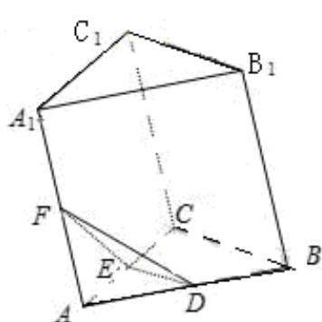

<!-- question-source:start -->
8、如图，在三棱柱 $A_{1}B_{1}C_{1}-ABC$ 中，D、E、F 分别为 AB、AC、 $AA_{1}$ 的中点，设三

棱锥 F-ADE 的体积为 $V_{1}$ ，三棱柱 $A_{1}B_{1}C_{1}-ABC$ 的体积为 $V_{2}$ ，则 $V_{1}: V_{2}=$ \_\_\_\_。
<!-- question-source:end -->

![[高中/真题/按年份分类/2013/2013年江苏高考数学试题及答案/填空题/题目/answers/Q00026706A1.md]]
