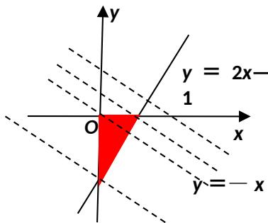

> [!faq]- 2013年江苏高考数学试题及答案解析
>
> > [!success]- **【答案】** [-2，]
>
> > [!note]- **【分析】**
> > 本题未单列分析。
>
> > [!note]- **【解析】**
> > 抛物线 $y = x^{2}$ 在 x = 1 处的切线易得为 y = 2x - 1，令 $z = x + 2y$ ， $y = -x +$ 。画出可行域如下，易得过点 (0, -1) 时， $z_{\min} = -2$ ，过点 (，0) 时， $z_{\max} =$ 。
> >
> > 
