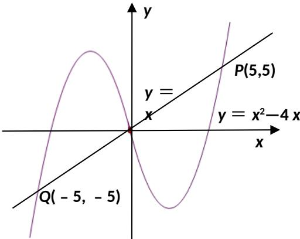

> [!faq]- 2013年江苏高考数学试题及答案解析
>
> > [!success]- **【答案】** $(-5,0)\cup(5,+\infty)$
>
> > [!note]- **【分析】**
> > 本题未单列分析。
>
> > [!note]- **【解析】**
> > 做出 $f(x)=x^{2}-4x$ (x>0) 的图像，如下图所示。由于 $f(x)$ 是定义在 R 上的奇函数，利用奇函数图像关于原点对称做出 x<0 的图像。不等式 $f(x)>x$ ，表示函数 $y=f(x)$ 的图像在 y=x 的上方，观察图像易得：解集为 $(-5,0)\cup(5,+\infty)$ 。
> >
> > 
