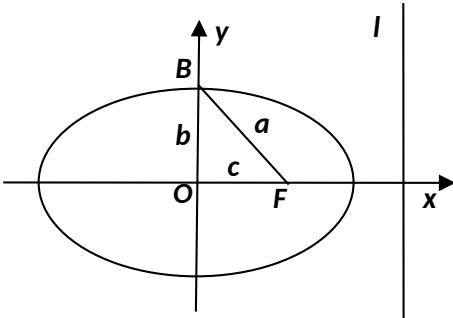

> [!faq]- 2013年江苏高考数学试题及答案解析
>
> > [!success]- **【答案】** $\frac{\sqrt{3}}{3}$ 【
>
> > [!note]- **【分析】**
> > 本题未单列分析。
>
> > [!note]- **【解析】**
> > 如图， $l: x = \frac{a^2}{c}$ ， $d_2 = \frac{a^2}{c} - c = \frac{b^2}{c}$ ，由等面积得： $d_{1}=\frac{bc}{a}$ 。若 $d_{2}=\sqrt{6}d_{1}$ ，则 $\frac{b^{2}}{c}=\sqrt{6}\frac{bc}{a}$ ，整理得： $\sqrt{6}a^{2}-ab-\sqrt{6}b^{2}=0$ ，两边同除以： $a^{2}$ ，得： $\sqrt{6}\left(\frac{b}{a}\right)^{2}-\left(\frac{b}{a}\right)+\sqrt{6}=0$ ，解之得： $\frac{b}{a}=\frac{\sqrt{6}}{3}$ ，所以，离心率为： $\mathrm{e} = \sqrt{1 - \left( \frac{b}{a} \right)^2} = \frac{\sqrt{3}}{3}$
> >
> > 
