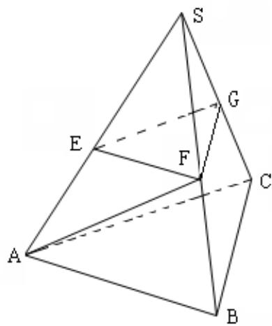
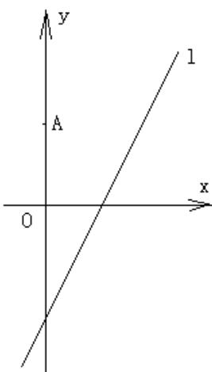

<!-- question-source:start -->
15、（本小题满分 14 分）

已知向量 $a=(\cos\alpha,\sin\alpha),b=(\cos\beta,\sin\beta),0<\beta<\alpha<\pi$ 。

(1) 若 $\left|a - b\right| = \sqrt{2}$ ，求证： $a \perp b$ ;

(2) 设 $c = (0,1)$ ，若 $a + b = c$ ，求 $\alpha, \beta$ 的值。

## 16、（本小题满分 14 分）

如图，在三棱锥 S-ABC 中，平面 $SAB \perp$ 平面 SBC, $AB \perp BC$ , AS=AB。过 A 作 $AF \perp SB$ ,

垂足为 F，点 E、G 分别为线段 SA、SC 的中点。

求证：（1）平面 EFG//平面 ABC；

(2) $BC \perp SA$ 。

## 17、（本小题满分 14 分）

如图，在平面直角坐标系 $xoy$ 中，点A(0,3)，直线 $l:y = 2x - 4$ ，设圆C的半径为1，圆心在直线 $l$ 上。

(1) 若圆心 C 也在直线 y = x - 1 上，过点 A 作圆 C 的切线，求切线的方程；

(2) 若圆 $c$ 上存在点 $M$ ，使 $MA = 2MO$ ，求圆心 $c$ 的横坐标 $a$ 的取值范围。

<!-- question-source:end -->

![[高中/真题/按年份分类/2013/2013年江苏高考数学试题及答案/解答题/题目/answers/Q00026713A1.md]]
