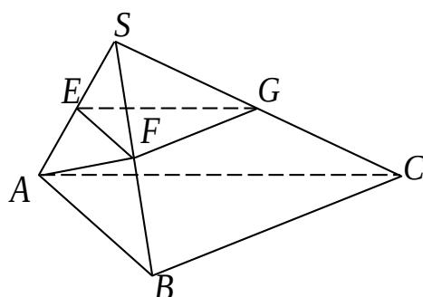

<!-- question-source:start -->
16.

证：（1）因为 SA=AB 且 AF⊥SB，

所以 F 为 SB 的中点.

又 E, G 分别为 SA, SC 的中点,

所以， $EF\|AB$ ， $EG\|AC$ 。

又 $AB \cap AC = A$ ， $AB \subset$ 面 SBC， $AC \subset$ 面 ABC，

所以，平面 $EFG / /$ 平面ABC.

(2) 因为平面 $SAB \perp$ 平面 SBC，平面 $SAB \cap$ 平面 SBC = BC， $AF \subset$ 平面 ASB， $AF \perp SB.$ 所以， $AF \perp$ 平面 SBC.
又 $BC \subset$ 平面 SBC，
所以， $AF \perp BC.$ 又 $AB \perp BC, AF \cap AB = A,$ 所以， $BC \perp$ 平面 SAB.
又 $SA \subset$ 平面 SAB，
所以， $BC \perp SA.$
<!-- question-source:end -->

![[高中/真题/按年份分类/2013/2013年江苏高考数学试题及答案/解答题/题目/answers/Q00026716A1.md]]
