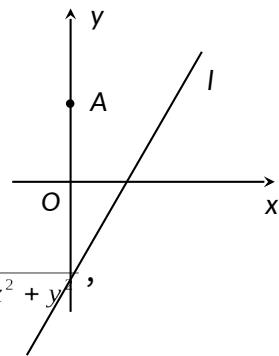

<!-- question-source:start -->
17. 解：(1) 联立： $\left\{\begin{aligned}y&=x-1\\ y&=2x-4\end{aligned}\right.$ ，得圆心为： $C(3,2)$ .

设切线为： $y = kx + 3$ ，

$d=\frac{|3k+3-2|}{\sqrt{1+k^{2}}}=r=1$ ，得： $k=0$ or $k=-\frac{3}{4}$

故所求切线为： $y = 0$ or $y = -\frac{3}{4} x + 3$ .

(2) 设点 $M(x, y)$ ，由 MA = 2MO，知： $\sqrt{x^{2} + (y - 3)^{2}} = 2\sqrt{x^{2} + y}$ ，
化简得： $x^{2}+(y+1)^{2}=4$ 即：点 M 的轨迹为以 $(0, 1)$ 为圆心，2 为半径的圆，可记为圆 D.
又因为点 M 在圆 C 上，故圆 C 圆 D 的关系为相交或相切.
故： $1 \leq |CD| \leq 3$ ，其中 $\left| CD \right| = \sqrt{a^{2} + (2a - 3)^{2}}$ .

解之得： $0 \leq a \leq$ .
<!-- question-source:end -->

![[高中/真题/按年份分类/2013/2013年江苏高考数学试题及答案/解答题/题目/answers/Q00026717A1.md]]
