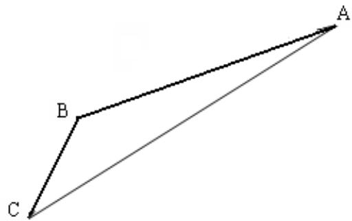

<!-- question-source:start -->
18、（本小题满分 16 分）

如图，游客从某旅游景区的景点 A 处下山至 C 处有两种路径。一种是从 A 沿直线步行到 C，另一种是先从 A 沿索道乘缆车到 B，然后从 B 沿直线步行到 C。

现有甲、乙两位游客从 A 处下山，甲沿 AC 匀速步行，速度为 50 米/分钟。在甲出发 2 分钟后，乙从 A 乘坐缆车到 B，在 B 处停留 1 分钟后，再从 B 匀速步行到 C。假设缆车速度为 130 米/分

钟，山路 AC 的长为 1260 米，经测量， $\cos A=\frac{12}{13},\cos C=\frac{3}{5}$ 。

(1) 求索道 AB 的长;

(2) 问乙出发多少分钟后，乙在缆车上与甲的距离最短？

(3) 为使两位游客在 C 处互相等待的时间不超过 3 分钟，乙步行的速度应控制在什么范围内？

<!-- question-source:end -->

![[高中/真题/按年份分类/2013/2013年江苏高考数学试题及答案/解答题/题目/answers/Q00029667A1.md]]
