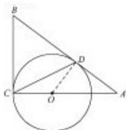
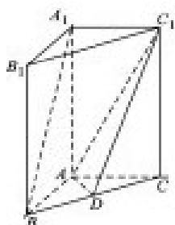

> [!faq]- 2013年江苏高考数学试题及答案解析
>
> > [!success]- **【答案】** 详见解析
>
> > [!note]- **【分析】**
> > 本题未单列分析。
>
> > [!note]- **【解析】**
> > 解答时应写出文字说明、证明过程或演算步骤．
> > A. [选修 4-1：几何证明选讲]（本小题满分 10 分）
> > 如图，AB 和 BC 分别与圆 O 相切于点 D、C，AC 经过圆心 O，且 BC=2OC。
> > 求证：AC=2AD。
> >
> >   
> > (第21-A题)
> >
> > B. [选修 4-2: 矩阵与变换] (本小题满分 10 分)
> >
> > 已知矩阵 $A=\begin{bmatrix}-1 & 0 \\ 0 & 2\end{bmatrix}, B=\begin{bmatrix}1 & 2 \\ 0 & 6\end{bmatrix}$ ，求矩阵 $A^{-1}B$ .
> >
> > C. [选修 4-4: 坐标系与参数方程]（本小题满分 10 分）
> >
> > 在平面直角坐标系 $xoy$ 中，直线 $l$ 的参数方程为 $\left\{ \begin{array}{l} x = t + 1 \\ y = 2t \end{array} \right.$ （ $t$ 为参数），曲线 $c$ 的参数方程为
> >
> > $\left\{ \begin{array}{l}x = 2\tan^2\theta \\ y = 2\tan \theta \end{array} \right.$ （ $\theta$ 为参数）。试求直线 $l$ 和曲线c的普通方程，并求出它们的公共点的坐标。
> >
> > D. [选修 4 - 5: 不等式选讲] (本小题满分 10 分)
> >
> > 已知 $a \geqslant b > 0$ ，求证： $2a^3 - b^3 \geqslant 2ab^2 - a^2b^\circ$
> >
> > 【必做题】第 22 题、第 23 题，每题 10 分，共计 20 分．请在答题卡指定区域内作答，解
> >
> > 
> >
> > ## 答时应写出文字说明、证明过程或演算步骤。
> >
> > ## 22. （本小题满分 10 分）
> >
> > 如图，在直三棱柱 $A_{1}B_{1}C_{1}-ABC$ 中，AB⊥AC，AB=AC=2， $A_{1}A=4$ ，点D是BC的中点。
> >
> > (1) 求异面直线 $A_{1}B$ 与 $C_{1}D$ 所成角的余弦值；
> >
> > (2) 求平面 $ADC_{1}$ 与平面 $ABA_{1}$ 所成二面角的正弦值。
> >
> > ## 23. （本小题满分 10 分）
> >
> > 设数列 $\left\{a_{n}\right\}$ ：1，-2，-2，3，3，3，-4，-4，-4，-4，…， $(-1)^{k-1}k,\cdots(-1)^{k-1}k$ ，…
> >
> > 即当 $\frac{(k-1)k}{2}<n\leq\frac{(k+1)k}{2}(k\in N^{*})$ 时， $a_{n}=(-1)^{k-1}k$ 。记 $S_{n}=a_{1}+a_{2}+\cdots+a_{n}(n\in N^{*})$ 。
> >
> > 对于 $l \in N^*$ ，定义集合 $P_l = \{n \mid S_n$ 为 $a_n$ 的整数倍， $n \in N^*$ ，且 $1 \leq n \leq l\}$
> >
> > (1)求 $P_{11}$ 中元素个数；
> >
> > (2)求集合 $P_{2000}$ 中元素个数。
> >
> > 参考
> > 答案
