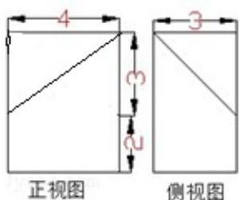
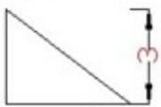

<!-- question-source:start -->
12. (4分) (2013·浙江) 若某几何体的三视图 (单位: cm) 如图所示, 则此几何体的体积等于 \_\_\_\_ cm $^{3}$ .

  
俯视图
<!-- question-source:end -->

![[高中/真题/按年份分类/2013/2013年浙江高考数学_理科_试卷_含答案_/填空题/题目/answers/Q00023387A1.md]]
