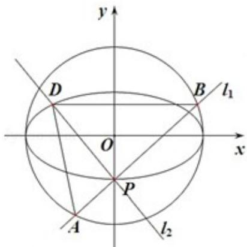

<!-- question-source:start -->
21. （15分）（2013·浙江）如图，点P（0，-1）是椭圆 $C_{1}:\frac{x^{2}}{a^{2}}+\frac{y^{2}}{b^{2}}=1\quad(a>b>0)$ 的一个顶点， $C_{1}$ 的长轴是圆 $C_{2}:x^{2}+y^{2}=4$ 的直径。 $l_{1}$ ， $l_{2}$ 是过点P且互相垂直的两条直线，其中 $l_{1}$ 交圆 $C_{2}$ 于两点， $l_{2}$ 交椭圆 $C_{1}$ 于另一点D

(1) 求椭圆 $C_{1}$ 的方程；

(2) 求 $\triangle ABD$ 面积取最大值时直线 $l_{1}$ 的方程.

<!-- question-source:end -->

![[高中/真题/按年份分类/2013/2013年浙江高考数学_理科_试卷_含答案_/填空题/题目/answers/Q00023396A1.md]]
