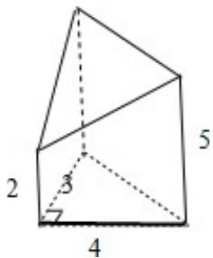

> [!faq]- 2013年浙江高考数学(理科)试卷(含答案)解析
>
> > [!success]- **【答案】** 24
>
> > [!note]- **【分析】**
> > 先根据三视图判断几何体的形状，再利用体积公式计算即可.
>
> > [!note]- **【解析】**
> > 解：几何体为三棱柱去掉一个三棱锥后的几何体，底面是直角三角形，直角边分别为3,4，棱柱的高为5，被截取的棱锥的高为3．如图：
> >
> > $$
> > \mathrm{V} = \mathrm{V} _ {\mathrm{棱柱}} - \mathrm{V} _ {\mathrm{三棱锥}} = \frac {1}{2} \times 3 \times 4 \times 5 - \frac {1}{3} \times \frac {1}{2} \times 3 \times 4 \times 3 = 2 4 (\mathrm{cm} ^ {3})
> > $$
> >
> > 故答案为：24
> >
> > 
> >
> > 点评：本题考查几何体的三视图及几何体的体积计算． $V_{椎体}=\frac{1}{3}Sh$ ， $V_{柱体}=Sh$ ．考查空间想象能力.
