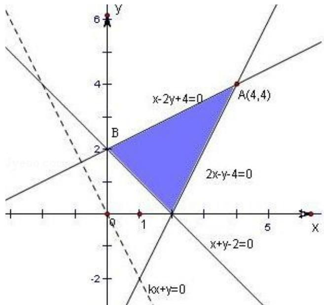

> [!faq]- 2013年浙江高考数学(理科)试卷(含答案)解析
>
> > [!success]- **【答案】** 2
>
> > [!note]- **【分析】**
> > 先画出可行域，得到角点坐标.再对k进行分类讨论，通过平移直线 $z = kx + y$ 得到最大值点A，即可得到答案.
>
> > [!note]- **【解析】**
> > 解：可行域如图：
> >
> > 由 $\left\{\begin{aligned}x-2y+4=0\\ 2x-y-4=0\end{aligned}\right.$ 得：A（4，4），
> >
> > 同样地，得 B（0，2），
> >
> > ① 当 $k > -\frac{1}{2}$ 时，目标函数 $z = kx + y$ 在 $x = 4$ ， $y = 4$ 时取最大值，即直线 $z = kx + y$ 在 $y$ 轴上的截距 $z$ 最大，此时， $12 = 4k + 4$
> >
> > 故 k=2.
> >
> > ② 当 $k \leqslant -\frac{1}{2}$ 时，目标函数 $z = kx + y$ 在 $x = 0$ ， $y = 2$ 时取最大值，即直线 $z = kx + y$ 在 $y$ 轴上的截距 $z$ 最大，此时， $12 = 0 \times k + 2$
> >
> > 故 $\mathbf{k}$ 不存在.
> >
> > 综上， $k=2$ .
> >
> > 故答案为：2.
> >
> > 
> >
> > 点评：本题主要考查简单线性规划。解决此类问题的关键是正确画出不等式组表示的可行域，将目标函数赋予几何意义。
