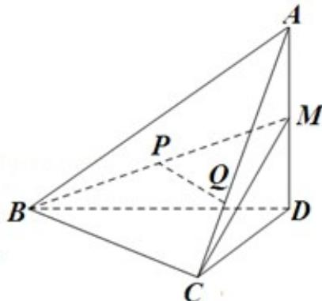

<!-- question-source:start -->
20. (15 分) (2013·浙江) 如图, 在四面体 A - BCD 中, AD⊥平面 BCD, BC⊥CD, AD=2, BD=2√2. M 是 AD 的中点, P 是 BM 的中点, 点 Q 在线段 AC 上, 且 AQ=3QC.

(1) 证明: PQ∥平面 BCD;

(2) 若二面角 C-BM-D 的大小为 $60^{\circ}$ ，求 $\angle BDC$ 的大小.

<!-- question-source:end -->

![[高中/真题/按年份分类/2013/2013年浙江高考数学_理科_试卷_含答案_/解答题/题目/answers/Q00023395A1.md]]
