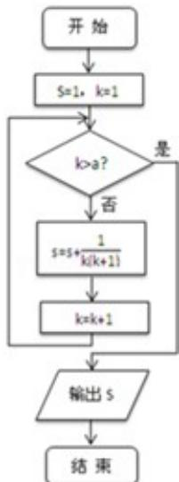

<!-- question-source:start -->
5. （5分）（2013·浙江）某程序框图如图所示，若该程序运行后输出的值是 $\frac{9}{5}$ ，则（ ）

A. $a = 4$ B. $a = 5$ C. $a = 6$ D. $a = 7$
<!-- question-source:end -->

![[高中/真题/按年份分类/2013/2013年浙江高考数学_理科_试卷_含答案_/选择题/题目/answers/Q00023380A1.md]]
