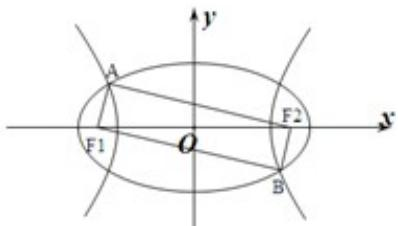

<!-- question-source:start -->
9.（5分）(2013·浙江)如图 $\mathrm{F_1}$ 、 $\mathrm{F_2}$ 是椭圆 $C_1: \frac{x^2}{4} + y^2 = 1$ 与双曲线C2的公共焦点A、B分别是 $C_1$ 、 $C_2$ 在第
二、四象限的公共点，若四边形 $\mathrm{AF}_1\mathrm{BF}_2$ 为矩形，则 $C_2$ 的离心率是（）

A. $\sqrt{2}$ B. $\sqrt{3}$ C. $\frac{3}{2}$ D. $\frac{\sqrt{6}}{2}$
<!-- question-source:end -->

![[高中/真题/按年份分类/2013/2013年浙江高考数学_理科_试卷_含答案_/选择题/题目/answers/Q00028233A1.md]]
