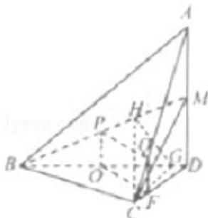

> [!faq]- 2013年浙江高考数学(理科)试卷(含答案)解析
>
> > [!success]- **【答案】** 详见解析
>
> > [!note]- **【分析】**
> > （1）取 BD 的中点 O，在线段 CD 上取点 F，使得 DF=3CF，连接 OP、OF、FQ。根据平行线分线段成比例定理结合三角形的中位线定理证出四边形 OPQF 是平行四边形，从而 PQ||OF，再由线面平行判定定理，证出 PQ||平面 BCD；
> > (2) 过点 C 作 CG⊥BD，垂足为 G，过 G 作 GH⊥BM 于 H，连接 CH．根据线面垂直的判定与性质证出
>
> > [!note]- **【解析】**
> > （1）取 BD 的中点 O，在线段 CD 上取点 F，使得 DF=3CF，连接 OP、OF、FQ
> >
> > ∵△ACD中，AQ=3QC且DF=3CF，∴QF∥AD且QF= $\frac{1}{4}$ AD
> >
> > ∵△BDM中，O、P分别为BD、BM的中点
> >
> > ∴OP∥DM，且 OP= $\frac{1}{2}$ DM，结合 M 为 AD 中点得：OP∥AD 且 OP= $\frac{1}{4}$ AD
> >
> > $$
> > \therefore \mathrm{OP} \| \mathrm{QF}
> > $$
> >
> > $$
> > \mathrm{OP} = \mathrm{QF}
> > $$
> >
> > $$
> > \therefore \mathrm{PQ} \| \mathrm{OF}
> > $$
> >
> > ∵PQ∉平面 BCD 且 OF⊂平面 BCD，∴PQ∥平面 BCD；
> > (2) 过点 C 作 CG⊥BD，垂足为 G，过 G 作 GH⊥BM 于 H，连接 CH
> > ∵AD⊥平面 BCD，CG⊂平面 BCD，∴AD⊥CG
> > 又∵CG⊥BD，AD、BD 是平面 ABD 内的相交直线
> > ∴CG⊥平面 ABD，结合 BM⊂平面 ABD，得 CG⊥BM
> > ∵GH⊥BM，CG、GH 是平面 CGH 内的相交直线
> > ∴BM⊥平面 CGH，可得 BM⊥CH
> > 因此，∠CHG 是二面角 C-BM-D 的平面角，可得 ∠CHG=60°
> >
> > 设 $\angle BDC = \theta$ ，可得
> >
> > 设∠BDC=0，可得
> > Rt△BCD中，CD=BDcosθ=2√2cosθ，CG=CDsinθ=2√2sinθcosθ，BG=BCsinθ=2√2sin²θ
> > Rt△BMD中，HG= $\frac{BG\cdot DM}{BM}=\frac{2\sqrt{2}}{3}\sin^{2}\theta$ ；Rt△CHG中，tan∠CHG= $\frac{CG}{GH}=\frac{3\cos\theta}{\sin\theta}=\sqrt{3}$ ∴tanθ= $\sqrt{3}$ ，可得θ=60°，即∠BDC=60°
> >
> > 
> >
> > 点评：本题在底面为直角三角形且过锐角顶点的侧棱与底面垂直的三棱锥中求证线面平行，并且在已知二面角大小的情况下求线线角。着重考查了线面平行、线面垂直的判定与性质，解直角三角形和平面与平面所成角求法等知识，属于中档题。
