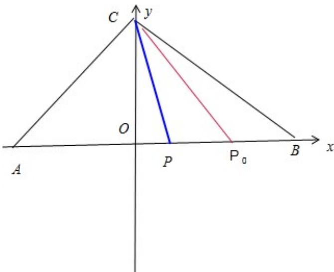

> [!faq]- 2013年浙江高考数学(理科)试卷(含答案)解析
>
> > [!success]- **【答案】** D
>
> > [!note]- **【分析】**
> > 以 AB 所在的直线为 x 轴，以 AB 的中垂线为 y 轴建立直角坐标系，设 AB=4, C(a, b), P(x, 0)，然后由题意可写出 $\overrightarrow{P_{0}B}$ ， $\overrightarrow{PB}$ ， $\overrightarrow{PC}$ ， $\overrightarrow{P_{0}C}$ ，然后由 $\overrightarrow{PB} \cdot \overrightarrow{PC} \geqslant \overrightarrow{P_{0}B} \cdot \overrightarrow{P_{0}C}$ 结合向量的数量积的坐标表示可得关于 x 的二次不等式，结合二次不等式的知识可求 a，进而可判断
>
> > [!note]- **【解析】**
> > 分析：以 AB 所在的直线为 x 轴，以 AB 的中垂线为 y 轴建立直角坐标系，设 AB=4, C(a, b), P(x, 0)，然后由题意可写出 $\overrightarrow{P_{0}B}$ ， $\overrightarrow{PB}$ ， $\overrightarrow{PC}$ ， $\overrightarrow{P_{0}C}$ ，然后由 $\overrightarrow{PB} \cdot \overrightarrow{PC} \geqslant \overrightarrow{P_{0}B} \cdot \overrightarrow{P_{0}C}$ 结合向量的数量积的坐标表示可得关于 x 的二次不等式，结合二次不等式的知识可求 a，进而可判断
> >
> > 解答：解：以 AB 所在的直线为 x 轴，以 AB 的中垂线为 y 轴建立直角坐标系，设 AB=4，C（a，b），P（x，0）则 $BP_{0}=1$ ，A（-2，0），B（2，0）， $P_{0}(1,0)$
> >
> > $\therefore \overrightarrow{P_0B} = (1, 0), \overrightarrow{PB} = (2 - x, 0), \overrightarrow{PC} = (a - x, b), \overrightarrow{P_0C} = (a - 1, b)$ $\therefore$ 恒有 $\overrightarrow{PB} \cdot \overrightarrow{PC} \geqslant \overrightarrow{P_0B} \cdot \overrightarrow{P_0C}$ $\therefore (2 - x)(a - x) \geqslant a - 1$ 恒成立  
> > 整理可得 $x^2 - (a + 2)x + a + 1 \geqslant 0$ 恒成立 $\therefore \triangle = (a + 2)^2 - 4(a + 1) \leqslant 0$ 即 $\triangle = a^2 \leq 0$ $\therefore a = 0$ ，即 C 在 AB 的垂直平分线上 $\therefore AC = BC$ 故 $\triangle ABC$ 为等腰三角形  
> > 故选 D
> >
> > 
> >
> > 点评：本题主要考查了平面向量的运算，向量的模及向量的数量积的概念，向量运算的几何意义的应用，还考查了利用向量解决简单的几何问题的能力
