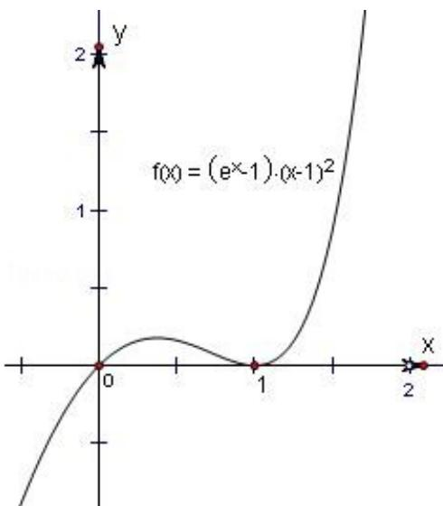

> [!faq]- 2013年浙江高考数学(理科)试卷(含答案)解析
>
> > [!success]- **【答案】** C
>
> > [!note]- **【分析】**
> > 通过对函数 $f(x)$ 求导，根据选项知函数在 $x = 1$ 处有极值，验证 $f'(1) = 0$ ，再验证 $f(x)$ 在 $x = 1$ 处取得极小值还是极大值即可得结论.
>
> > [!note]- **【解析】**
> > 解：当 k=2 时，函数 $f(x) = (e^{x} - 1) \quad (x - 1)^{2}$ .
> >
> > 求导函数可得 $f'(x) = e^{x}(x - 1)^{2} + 2(e^{x} - 1)(x - 1) = (x - 1)(xe^{x} + e^{x} - 2)$ ，∴ 当 x = 1， $f'(x) = 0$ ，且当 x > 1 时， $f'(x) > 0$ ，当 $\frac{1}{2} < x < 1$ 时， $f'(x) < 0$ ，故函数 $f(x)$ 在 $(1, +\infty)$ 上是增函数；
> >
> > 在 $(\frac{1}{2}, 1)$ 上是减函数，从而函数 $f(x)$ 在 $x = 1$ 取得极小值。对照选项。故选C.
> >
> > 
> >
> > 点评：本题考查了函数的极值问题，考查学生的计算能力，正确理解极值是关键.
