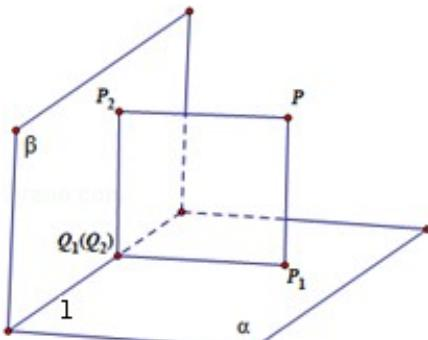

> [!faq]- 2013年浙江高考数学(理科)试卷(含答案)解析
>
> > [!success]- **【答案】** A
>
> > [!note]- **【分析】**
> > 设 $P_{1}$ 是点 P 在 $\alpha$ 内的射影，点 $P_{2}$ 是点 P 在 $\beta$ 内的射影。根据题意点 $P_{1}$ 在 $\beta$ 内的射影与 $P_{2}$ 在 $\alpha$ 内的射影重合于一点，由此可得四边形 $PP_{1}Q_{1}P_{2}$ 为矩形，且 $\angle P_{1}Q_{1}P_{2}$ 是二面角 $\alpha - 1 - \beta$ 的平面角，根据面面垂直的定义可得平面 $\alpha$ 与平面 $\beta$ 垂直，得到本题
>
> > [!note]- **【解析】**
> > 分析：设 $P_{1}$ 是点 P 在 $\alpha$ 内的射影，点 $P_{2}$ 是点 P 在 $\beta$ 内的射影。根据题意点 $P_{1}$ 在 $\beta$ 内的射影与 $P_{2}$ 在 $\alpha$ 内的射影重合于一点，由此可得四边形 $PP_{1}Q_{1}P_{2}$ 为矩形，且 $\angle P_{1}Q_{1}P_{2}$ 是二面角 $\alpha - 1 - \beta$ 的平面角，根据面面垂直的定义可得平面 $\alpha$ 与平面 $\beta$ 垂直，得到本题
> > 答案。
> > 解答：解：设 $P_{1}=f_{\alpha}(P)$ ，则根据题意，得点 $P_{1}$ 是过点 P 作平面 $\alpha$ 垂线的垂足 $\because Q_{1}=f_{\beta}[f_{\alpha}(P)]=f_{\beta}(P_{1})$ ∴点 $Q_{1}$ 是过点 $P_{1}$ 作平面 $\beta$ 垂线的垂足
> > 同理，若 $P_{2}=f_{\beta}(P)$ ，得点 $P_{2}$ 是过点 P 作平面 $\beta$ 垂线的垂足
> > 因此 $Q_{2}=f_{\alpha}[f_{\beta}(P)]$ 表示点 $Q_{2}$ 是过点 $P_{2}$ 作平面 $\alpha$ 垂线的垂足
> > ∵对任意的点 P，恒有 $PQ_{1}=PQ_{2}$ ，
> > ∴点 $Q_{1}$ 与 $Q_{2}$ 重合于同一点
> > 由此可得，四边形 $PP_{1}Q_{1}P_{2}$ 为矩形，且 $\angle P_{1}Q_{1}P_{2}$ 是二面角 $\alpha - l - \beta$ 的平面角 $\because\angle P_{1}Q_{1}P_{2}$ 是直角，∴平面 $\alpha$ 与平面 $\beta$ 垂直
> > 故选：A
> >
> > 
> >
> > 点评：本题给出新定义，要求我们判定平面 $\alpha$ 与平面 $\beta$ 所成角大小，着重考查了线面垂直性质、二面角的平面角和面面垂直的定义等知识，属于中档题.
> >
> > ## 二、填空题：本大题共7小题，每小题4分，共28分.
