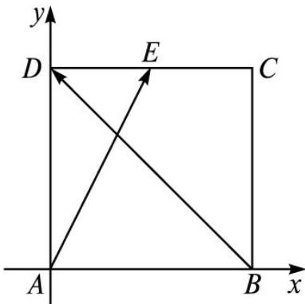

> [!faq]- 2013年理科数学海南省高考真题含答案解析
>
> > [!success]- **【答案】** 2
>
> > [!note]- **【分析】**
> > 本题未单列分析。
>
> > [!note]- **【解析】**
> > 以 $AB$ 所在直线为 $x$ 轴， $AD$ 所在直线为 $y$ 轴建立平面直角坐标系，如图所示，则点 $A$ 的坐标为 $(0,0)$ ，点 $B$ 的坐标为 $(2,0)$ ，点 $D$ 的坐标为 $(0,2)$ ，点 $E$ 的坐标为 $(1,2)$ ，则 $AE = (1,2)$ ， $BD = (-2,2)$ ，所以 $AE \cdot BD = 2$ 。
> >
> > 
