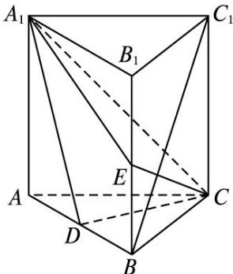

<!-- question-source:start -->
18. (2013 课标全国 II, 理 18)(本小题满分 12 分)如图, 直三棱柱 $ABC - A_{1}B_{1}C_{1}$ 中, $D, E$ 分别是 $AB, BB_{1}$ 的中

点， $AA_{1}=AC=CB=\frac{\sqrt{2}}{2}AB$ .

(1)证明： $BC_{1}$ ||平面 $A_{1}CD$ ;

(2)求二面角 $D-A_{1}C-E$ 的正弦值.

<!-- question-source:end -->

![[高中/真题/按年份分类/2013/2013年理科数学海南省高考真题含答案/解答题/题目/answers/Q00023325A1.md]]
