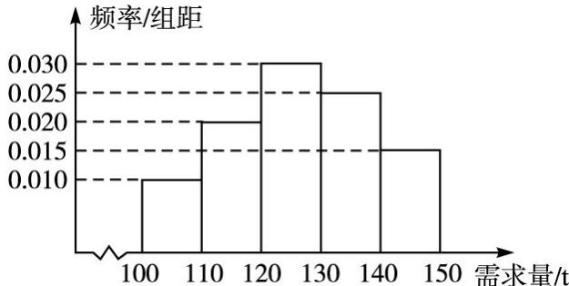

<!-- question-source:start -->
19. (2013 课标全国 II, 理 19)(本小题满分 12 分)经销商经销某种农产品, 在一个销售季度内, 每售出 1 t 该产品获利润 500 元, 未售出的产品, 每 1 t 亏损 300 元. 根据历史资料, 得到销售季度内市场需求量的频率分布直方图, 如图所示. 经销商为下一个销售季度购进了 130 t 该农产品. 以 X(单位: t, $100 \leq X \leq 150$ ) 表示下一个销售季度内的市场需求量, T(单位: 元) 表示下一个销售季度内经销该农产品的利润.

(1) 将 T 表示为 X 的函数;

(2)根据直方图估计利润 T 不少于 57 000 元的概率；

(3)在直方图的需求量分组中，以各组的区间中点值代表该组的各个值，并以需求量落入该区间的频率作为需求量取该区间中点值的概率(例如：若需求量 $X \in [100, 110)$ ，则取 $X = 105$ ，且 $X = 105$ 的概率等于需求量落入[100, 110)的频率)，求 $T$ 的数学期望. ↑ 频率/组距

<!-- question-source:end -->

![[高中/真题/按年份分类/2013/2013年理科数学海南省高考真题含答案/解答题/题目/answers/Q00023326A1.md]]
